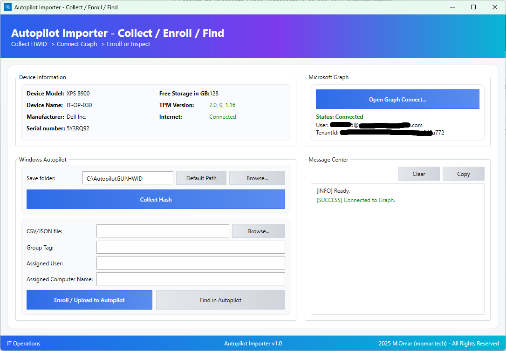

# 🚀 Autopilot Importer


---

## 📖 Overview
**Autopilot Importer** is a **dual-mode tool** for Windows that provides both:

- ⚡ **CLI (PowerShell Script)** — for automation and scripting (`Autopilot Importer.ps1`)  
- 🖥️ **GUI (EXE)** — for helpdesk and daily operations (`Autopilot Importer.exe`)

It simplifies **Windows Autopilot onboarding** by letting IT admins:

- Collect **hardware hashes (HWID)** into CSV  
- Connect to **Microsoft Graph** (Interactive or App-only auth)  
- Enroll (upload) devices into **Intune Autopilot** from CSV/JSON  
- Search & manage existing Autopilot devices  
- View **local device details** (model, serial, TPM, storage, network)  
- Keep all data organized under:  

```

C:\AutopilotGUI{HWID, Logs, Settings}

````

---

## **Screenshot**


---

## ✨ Features
- ✅ **Dual Support** → Run as **script** or **packaged EXE**
- ✅ **HWID Collector** → CSV compliant with Autopilot requirements
- ✅ **Graph Auth** → Delegated (interactive) or App-only (secret/cert)
- ✅ **Autopilot Enroll** → Upload CSV/JSON or auto-create one-device CSV
- ✅ **Device Lookup** → Search by serial number
- ✅ **Message Center** → Real-time color logs + daily log file

---

## ⚙️ Requirements
- **Windows PowerShell 5.1**  
- **.NET WPF assemblies** (present by default in Windows 10/11)  
- **Microsoft.Graph.Authentication** module  

Install module once (elevated PowerShell):  
```powershell
Install-Module Microsoft.Graph.Authentication -Scope AllUsers -Force
````

### 📌 Required Microsoft Graph Permissions

* `User.Read` (delegated)
* `Device.Read.All`
* `DeviceManagementServiceConfig.ReadWrite.All`

---

## 🚀 Usage

### ▶️ Option 1: Run as CLI

```powershell
Set-ExecutionPolicy RemoteSigned -Scope Process -Force
.\Autopilot Importer.ps1
```

### 🖥️ Option 2: Run as GUI

* Double-click **`Autopilot Importer.exe`**
* Loads full WPF interface (no PowerShell window required)

---

## 🔄 Typical Workflow

1. **Collect HWID** → Save folder → **Collect Hash** → CSV generated
2. **Connect to Graph** → Choose **Interactive** or **App-only** auth
3. **Enroll Devices** → Upload CSV/JSON or auto-generate → Add optional GroupTag/User/Name → **Upload**
4. **Find Devices** → Search by **serial number**

---

## 📂 Accepted File Formats

### CSV

```csv
Device Serial Number,Windows Product ID,Hardware Hash
"PF12345","00330-80000-00000-AAOEM","<base64HWID>"
```

### JSON

```json
[
  {
    "serialNumber": "PF12345",
    "productKey": "00330-80000-00000-AAOEM",
    "hardwareIdentifier": "<base64HWID>",
    "groupTag": "IT-Std",
    "assignedUserPrincipalName": "user@contoso.com",
    "assignedComputerName": "PC-IT-001"
  }
]
```

---

## 📊 Logging

* GUI → **Message Center** shows logs in color (INFO, SUCCESS, WARN, ERROR)
* Files → `C:\AutopilotGUI\Logs\app_YYYYMMDD.log`

---

## ⚡ Quick CLI Commands

Collect HWID directly:

```powershell
.\Autopilot Importer.ps1 -CollectHWID -OutPath "C:\HWID"
```

Enroll from CSV:

```powershell
.\Autopilot Importer.ps1 -Enroll -Path "C:\HWID\AutopilotHWID.csv" -GroupTag "IT-Std"
```

Lookup device by serial:

```powershell
.\Autopilot Importer.ps1 -Find -Serial "PF12345"
```

*(Flags depend on how you extend the CLI side; the GUI already covers these actions.)*

---

## 🛡️ Notes

* `.ps1` → Best for **automation / scripted deployments**
* `.exe` → Best for **GUI workflows** (helpdesk, end-user support)
* Packaged EXE may take a few seconds to start (module & WPF load)

---

## 📜 License

This project is licensed under the [MIT License](https://opensource.org/licenses/MIT).

---

## ⚠️ Disclaimer

This script is provided **as-is** without warranty.
The author is **not responsible** for unintended modifications or data loss.
Always test thoroughly before deploying in production.

