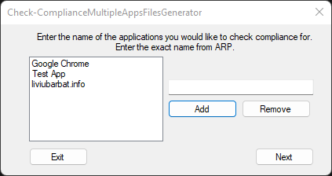

# 🧰 Intune Custom Compliance Generator


---

# 📖 Overview

**Check-ComplianceMultipleAppsFilesGenerator** is a lightweight **GUI tool** designed to help IT administrators quickly generate **Microsoft Intune Custom Compliance policies** for multiple applications.

The tool automatically generates the required:

- **PowerShell detection script**
- **JSON compliance rule**

These files can be uploaded directly into **Microsoft Intune** to enforce application compliance policies.

This eliminates the need to manually write detection scripts and JSON rules, saving time and reducing configuration errors. :contentReference[oaicite:0]{index=0}

---

# 🖥 Interface

The tool provides a simple interface where administrators can enter application names and generate compliance files.



---

# ✨ Key Features

✔️ Simple **graphical interface**  
✔️ Supports **multiple applications in one policy**  
✔️ Generates **PowerShell detection scripts automatically**  
✔️ Generates **JSON compliance rules for Intune**  
✔️ Supports two compliance modes  
✔️ No installation required (portable tool)

---

# ⚙ Compliance Modes

The generator supports two policy types.

## 1️⃣ Application Presence Check

Checks whether an application exists on the device.

Typical use cases:

- Block unauthorized software
- Detect prohibited applications
- Enforce application removal policies

Example:

```

Google Chrome detected → Non-Compliant

```

---

## 2️⃣ Application Version Check

Ensures an application version meets a **minimum required version**.

Example:

```

Installed Version: 132.0.1
Required Version: 133.0.6943.54
Result: Non-Compliant

```

---

# 📂 Generated Files

The tool generates the following files:

```

Check-ComplianceMultipleApps.ps1
Check-ComplianceMultipleApps.json

```

These files are packaged into a **ZIP archive** for easy deployment.

---

# 🚀 Usage

## 1️⃣ Run the Tool

Download and run:

```

Check-ComplianceMultipleAppsFilesGenerator.exe

```

No installation required.

---

## 2️⃣ Enter Application Names

Enter application names exactly as they appear in:

```

Add or Remove Programs
appwiz.cpl

```

Example:

```

Google Chrome
Zoom
TeamViewer

```

Click **Add** to include them in the list.

---

## 3️⃣ Choose Compliance Type

Select one of the following:

- **Check application presence**
- **Check application version**

You can also select installation scope:

```

HKLM → Machine-wide installation
HKCU → User-based installation

```

---

## 4️⃣ Configure Version (Optional)

If **version check** is selected:

Enter the minimum required version for each application.

Example:

```

133.0.6943.54

```

---

## 5️⃣ Generate Files

The tool will generate:

```

PowerShell Detection Script
JSON Compliance Rule

````

Both files are saved as a **ZIP package** ready for Intune deployment.

---

# 📊 Example Generated Script

Example PowerShell detection script:

```powershell
$AppNames = @("Google Chrome","Zoom")

foreach ($app in $AppNames) {
    $installed = Get-ItemProperty `
        HKLM:\Software\Microsoft\Windows\CurrentVersion\Uninstall\* `
        -ErrorAction SilentlyContinue |
        Where-Object { $_.DisplayName -match $app }

    if ($installed) {
        Write-Host "$app detected"
        exit 1
    }
}

exit 0
````

---

# ☁ Deployment in Microsoft Intune

1. Upload **PowerShell script** as a **Custom Compliance Detection Script**

2. Upload **JSON file** as the **Compliance Rule**

3. Assign the policy to:

```
Device groups
or
User groups
```

4. Monitor results in:

```
Intune Admin Center
Devices → Compliance Policies
```

---

# 💡 Example Use Cases

### Block Unauthorized Software

Prevent installation of:

* Chrome
* Zoom
* TeamViewer
* Any unapproved application

---

### Enforce Application Versions

Ensure devices run the latest version of:

* Browsers
* VPN clients
* Security software

---

### Compliance Automation

Automatically detect and flag non-compliant devices across the organization.

---

# ⚠ Notes

* Application names must match **exactly** what appears in `appwiz.cpl`.
* Always test policies on a **pilot device group** before production deployment.
* Ensure scripts run in **64-bit PowerShell** within Intune.

---

## 📜 License

This project is licensed under the [MIT License](https://opensource.org/licenses/MIT).

---

## 👤 Author

**Mohammad Abdulkader Omar**  
Website: https://momar.tech  
Version: **1.1**

---

## ☕ Support

If this project helps you, consider supporting it:

[](https://www.buymeacoffee.com/mabdulkadrx)

---

## ⚠ Disclaimer

These scripts are provided as-is. Test them in a staging environment before applying them to production. The author is not responsible for any unintended outcomes resulting from their use.