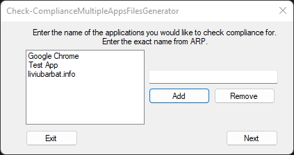

<div align="center">

# 🖥️ Intune Custom Compliance Generator

**Portable GUI tool that generates Microsoft Intune custom compliance files for multiple applications.**

Produces the PowerShell detection script and JSON compliance rule ready for direct upload into Intune, so administrators can enforce app presence and version policies without hand-writing either file.

[](#%EF%B8%8F-usage)
[](#%EF%B8%8F-usage)
[](https://learn.microsoft.com/en-us/powershell/)
[](#%EF%B8%8F-requirements)
[](#-license)
[](#-overview)

[Overview](#-overview) • [Features](#-core-features) • [Usage](#%EF%B8%8F-usage) • [Requirements](#%EF%B8%8F-requirements) • [License](#-license)

</div>

---

# 📖 Overview

**Intune Custom Compliance Generator** (`Check-ComplianceMultipleAppsFilesGenerator`) is a lightweight **GUI tool** designed to help IT administrators quickly generate **Microsoft Intune Custom Compliance policies** for multiple applications.

The tool automatically generates the required:

* **PowerShell detection script**
* **JSON compliance rule**

These files can be uploaded directly into **Microsoft Intune** to enforce application compliance policies, eliminating manual script and rule writing while reducing configuration errors.

### 🖼️ Screenshots



*Main window of the generator with the application list, compliance mode selection, and scope options.*

---

# ✨ Core Features

### 🔹 Simple Graphical Interface
* Enter application names and generate compliance files in minutes
* No installation required — portable tool

### 🔹 Multiple Applications Per Policy
* Add as many applications as needed to a single policy
* Names validated against `Add or Remove Programs` entries

### 🔹 Automatic File Generation
* Generates the **PowerShell detection script** automatically
* Generates the **JSON compliance rule** for Intune

### 🔹 Two Compliance Modes
* Application presence check and application version check
* Machine-wide (`HKLM`) or user-based (`HKCU`) installation scope

---

# 📂 Project Structure

```text
CustomCompliancePolicyGeneratorGUI
│
├── Check-ComplianceMultipleAppsFilesGenerator.exe
├── Screenshot.png
└── README.md
```

Generated output (packaged as a ZIP for deployment):

```text
Check-ComplianceMultipleApps.ps1
Check-ComplianceMultipleApps.json
```

---

# 🚀 Getting Started

### Prerequisites
* Windows 10 / Windows 11
* Application names exactly as they appear in `appwiz.cpl`

### Installation
1. Download `Check-ComplianceMultipleAppsFilesGenerator.exe`
2. Run it — no installation required

---

# 🖥️ Usage

### 1️⃣ Run the Tool
Launch the executable and enter application names exactly as they appear in **Add or Remove Programs**, then click **Add**:

```text
Google Chrome
Zoom
TeamViewer
```

### 2️⃣ Choose Compliance Type
Select one of the following:

* **Check application presence**
* **Check application version**

Also select the installation scope:

```text
HKLM → Machine-wide installation
HKCU → User-based installation
```

### 3️⃣ Configure Version (Optional)
If **version check** is selected, enter the minimum required version for each application:

```text
133.0.6943.54
```

### 4️⃣ Generate Files
The tool generates the detection script and JSON rule, saved as a **ZIP package** ready for Intune deployment.

### Exit Codes
| Code | Status |
| ---- | ------ |
| 0    | Normal exit after the user closes the window |

---

# ⚙️ Requirements

### Operating System
* Windows 10 / Windows 11

### PowerShell
* Generated scripts target PowerShell **5.1 or later** (64-bit context inside Intune)

### Permissions
* Standard user to run the generator
* Intune administrative role to upload the generated policy

---

# 🧩 Compliance Modes

## 1️⃣ Application Presence Check
Checks whether an application exists on the device.

Typical use cases:

* Block unauthorized software
* Detect prohibited applications
* Enforce application removal policies

Example:

```text
Google Chrome detected → Non-Compliant
```

## 2️⃣ Application Version Check
Ensures an application version meets a **minimum required version**.

Example:

```text
Installed Version: 132.0.1
Required Version: 133.0.6943.54
Result: Non-Compliant
```

---

# 📊 Example Generated Script

```powershell
$AppNames = @("Google Chrome","Zoom")

foreach ($app in $AppNames) {
    $installed = Get-ItemProperty `
        HKLM:\Software\Microsoft\Windows\CurrentVersion\Uninstall\* `
        -ErrorAction SilentlyContinue |
        Where-Object { $_.DisplayName -match $app }

    if ($installed) {
        Write-Host "$app detected"
        exit 1
    }
}

exit 0
```

---

# ☁️ Deploying Generated Policies

1. Upload the **PowerShell script** as a **Custom Compliance Detection Script**
2. Upload the **JSON file** as the **Compliance Rule**
3. Assign the policy to device groups or user groups
4. Monitor results in the Intune admin center under **Devices → Compliance Policies**

---

# 💡 Example Use Cases

### Block Unauthorized Software
**Mohammad Abdelkader Omar**  
GitHub: [@mabdulkadr](https://github.com/mabdulkadr)  
Website: [momar.tech](https://momar.tech)
## 👤 Author
**Mohammad Abdelkader Omar**  
GitHub: [@mabdulkadr](https://github.com/mabdulkadr)  
Website: [momar.tech](https://momar.tech)
## 📜 License
This project is licensed under the [MIT License](https://opensource.org/licenses/MIT).

---

## ⚠ Disclaimer

This skill and every script it generates are provided as-is with no warranty of any kind. Test generated tools in a staging environment before deploying to production. The authors assume no liability for any damage or data loss resulting from their use.

---
<div align="center">

⭐ **If this skill saves you time, star the repo — it helps others find it.**

[Report an Issue](../../issues) · [momar.tech](https://momar.tech)

[](https://www.buymeacoffee.com/mabdulkadrx)

Built with [**PowerShell Enterprise Admin**](https://github.com/mabdulkadr/powershell-enterprise-admin-skill)

</div>

